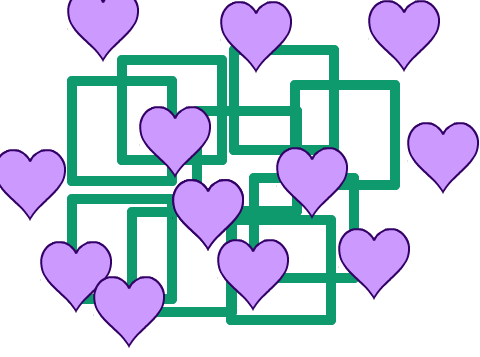
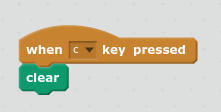
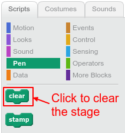

The `clear` {.blockpen} block clears the Scratch stage of lines and stamps created using `pen` or `stamp` blocks. 

After clearing the stage, you will just see the backdrop with any sprites that are not hidden:

You can use `clear`{:class="blockpen"} in a script:

You can also just click on `clear`{:class="blockpen"} in the palette without dragging the block onto the stage:

